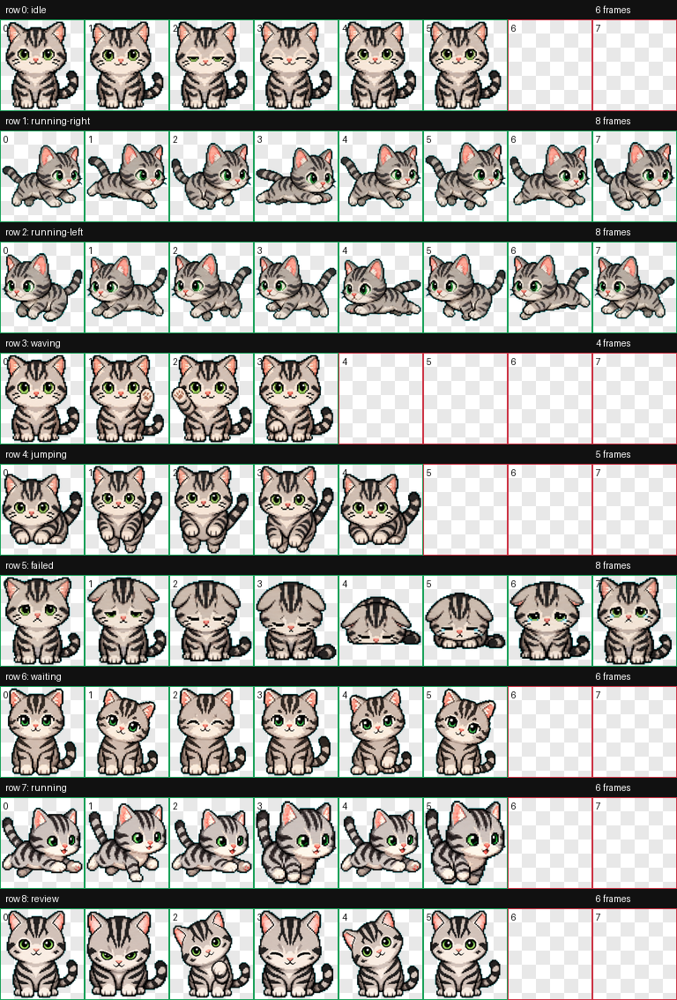

# Mimi Codex Pet

Mimi is a custom Codex pet based on a silver tabby American Shorthair kitten. The package includes a Codex-compatible animated spritesheet, manifest, QA contact sheet, and a small set of generation notes.


## Install

From this repository:

```bash
./install.sh
```

Or copy the pet files manually:

```bash
mkdir -p ~/.codex/pets/mimi
cp pet/pet.json pet/spritesheet.webp ~/.codex/pets/mimi/
```

Restart Codex after installing, then choose `Mimi` from custom pets.

## Contents

- `pet/pet.json` - Codex pet manifest.
- `pet/spritesheet.webp` - 8x9 animated pet atlas, 1536x1872 RGBA.
- `qa/contact-sheet.png` - visual QA sheet for all animation rows.
- `qa/validation.json` - atlas validation output.
- `qa/review.json` - frame extraction and geometry QA.
- `qa/videos/` - a few preview animation clips.
- `source/prompts/` - selected prompts used during generation.
- `source/references/canonical-base.png` - approved base pet reference.

## Animation States

The generated atlas includes:

- `idle`
- `running-right`
- `running-left`
- `waving`
- `jumping`
- `failed`
- `waiting`
- `running`
- `review`

`running-left` was derived by mirroring the approved `running-right` row because Mimi has no text, logo, handed prop, or direction-specific accessory.

## QA Summary

The final `spritesheet.webp` passed validation:

- format: `WEBP`
- mode: `RGBA`
- size: `1536x1872`
- errors: none
- warnings: none

The contact sheet below is a QA artifact, not the in-app display. Red outlined checkerboard cells are expected unused transparent slots for animation rows with fewer than 8 frames.



## License

See `LICENSE`.
